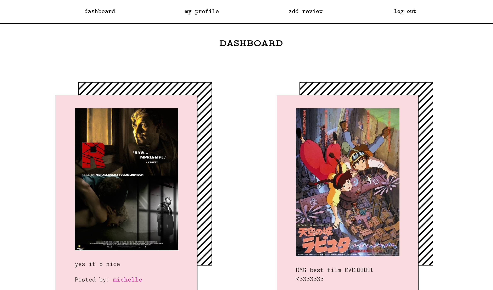

# Table of contents

- [Routes](#routes)
- [Overview](#overview)
  - [Features](#features)
  - [Screenshot](#screenshot)
  - [Links](#links)
- [My process](#my-process)
  - [Built with](#built-with)
- [Author](#author)

## Routes

### /

- Dashboard where users can view all posts from all users

### /login

- Login page

### /create

- Sign up page

### /review/:id

- Single review with post id

### /user/:uid

- User's profile page with user id

## Overview

### Features

Users should be able to:

- create and login to their account
- search films by name and post a review
- view all posts and also individual posts
- view all posts by the user on their profile page
- view other user's profile

### Screenshot

### Links

- Live Site URL: [https://thirsty-archimedes-6936ce.netlify.app/]
- Backend Repo: [https://github.com/mw3981/Film-Review-App-Backend]
- Backend Live URL: [https://young-retreat-88062.herokuapp.com]

## My process

### Built with

- Semantic HTML5
- CSS
- React.js
- Node.js
- Express.js
- Firebase
- REST API

# Author

- Michelle Wong [https://michellewong.me]
